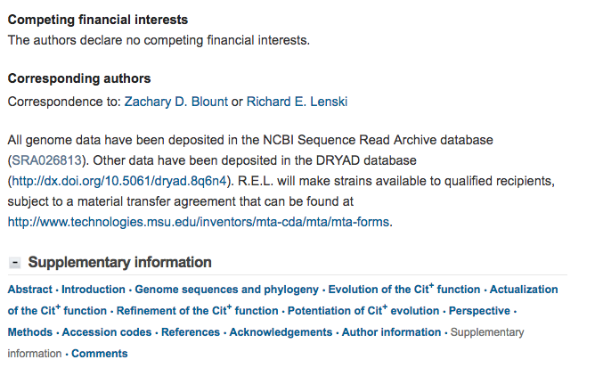
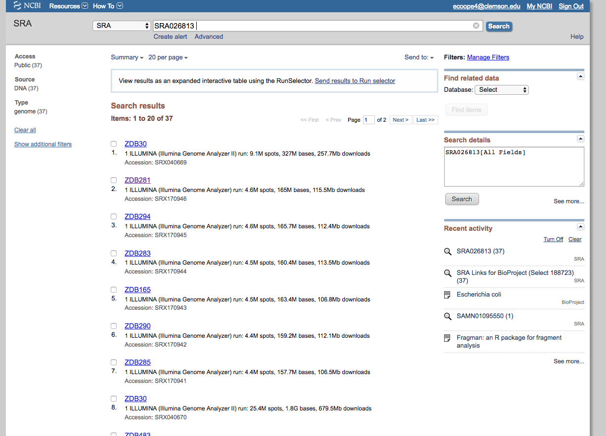
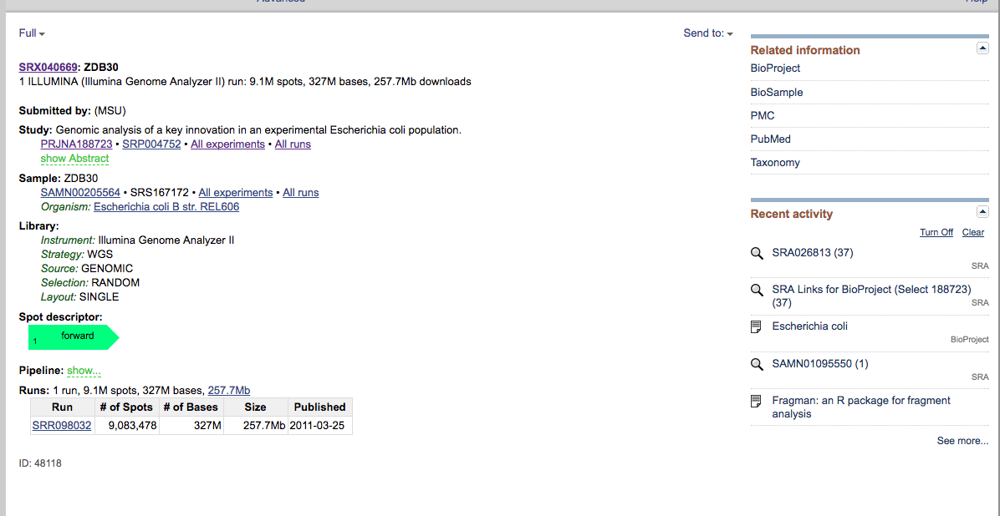
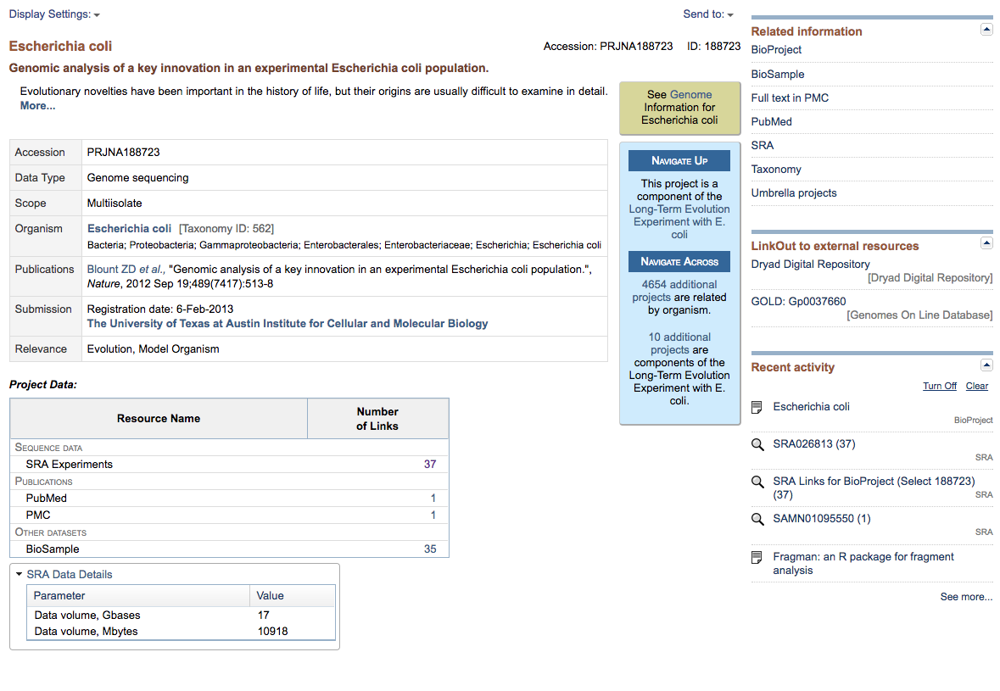
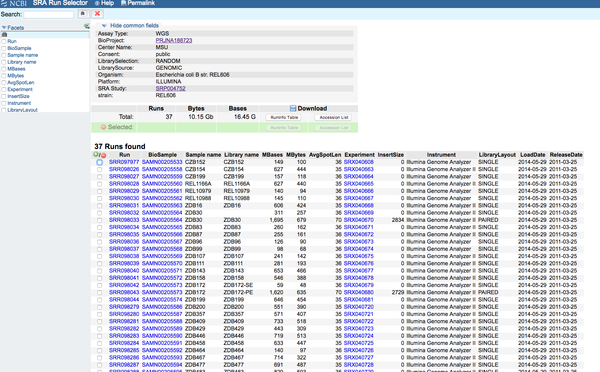

# Data Set
In this workshop, we will be working with *E. coli* data generated as part of a [2012 study](https://www.nature.com/nature/journal/v489/n7417/full/nature11514.html) that tracked the evolutionary origins of a novel trait.  For our purposes, we'll only be using 5 of the sequencing libraries, described in the table below.

| SRA ID | Sample Name | Sequencing Description |
|--------|:-----------:|:----------------------:|
| SRR098034 | ZDB83 | Illumina Single End |
| SRR098035 | ZDB87 | Illumina Single End |
| SRR098038 | ZDB107 | Illumina Single End |
| SRR098039 | ZDB111 | Illumina Single End |
| SRR098289 | ZDB564 | Illumina Single End |

# Finding the Data Online
The [NCBI Sequencing Read Archive](https://www.ncbi.nlm.nih.gov/sra) is a large respository for publicly available next-generation sequencing data that can be accessed from the same site as the commonly used tools BLAST and Pubmed.  Many journals now require authors to submit their raw data to the SRA before they can publish results from a next-gen study, so being familiar with the site and the associated SRA toolkit is key.

Let's assume that you hadn't been given the table of SRA IDs above, and that you were trying to find the data after the reading the [original paper](https://www.nature.com/nature/journal/v489/n7417/full/nature11514.html).  Click on the link to the paper, and then scroll to the end (after the References, before the Supplementary Information).  You will see a short section listing the data availability and the corresponding locations:

In this section, the authors give the SRA ID for their full submission, so you can get to it by either clicking the link or searching that ID on the SRA home page.  When you click (or search) for SRA026813, you will be taken to a list of all experiments/samples that were uploaded as part of this project (in this case, there are 37 experiments total):

If we click on the first result (ZDB30), we get some more details:

We can click on the Abstract to get a description of the study (which should match up to the paper).  We can also see that there is a BioProject number (PRJNA188723), which not only links back to all the other associated SRA experiments, but also has PubMed links to the paper:

If you go back to the ZDB30 information page, you'll also see that the individual run ID (the SRR number) is also listed at the bottom.  This is the number that you need to download runs remotely using the SRA toolkit (which is what we will be doing).  If you only want to download a few runs from the database, then clicking on individual sample IDs and manually getting the SRR number (or just clicking to download them) is not too bad, but if you want to download a lot of things, having to click each ID to get the SRR number starts to be a pain.  To automatically get a list of all SRR IDs in an experiment, go back to the [search results page](https://www.ncbi.nlm.nih.gov/sra?term=SRA026813), and click the link at the very top which says "Send results to Run selector."  When you do, you should get to a page with a table of all sample names along with their Run, BioSample, and Experiment IDs:

Not only does this format make the ID info. easier to find, but you can also download a text file version of the table, which could then be easily incorporated into a Shell script that would run the SRA toolkit download functions on the entire list of IDs.  You can also click a subset of samples, and then download a table of just the relevant information.  We aren't going to use this today, since we are downloading only a few files, but for a large download this would be the method to use. 

# Download the Data
In this section, we will see how to actually use the commands in the SRA toolkit to download a raw data file and convert it into Fastq format.

First, create a directory to hold the raw data files:
~~~
[nelle@login001 genomics-workshop]$ mkdir Raw_Fastq
~~~

Log onto an interactive node:
~~~
[nelle@login001 genomics-workshop]$ qsub -I -l select=1:ncpus=2:mem=31gb:interconnect=1g,walltime=1:00:00
qsub (Warning): Interactive jobs will be treated as not rerunnable
qsub: waiting for job 465026.pbs02 to start
qsub: job 465026.pbs02 ready

[nelle@node1134 ~]$
~~~

Load the SRA toolkit module:
~~~ 
[nelle@node1134 ~]$ module load sratoolkit/2.8.2-1
~~~

Now, fetch the first .sra file from the ncbi repository:
~~~
[nelle@node1134 ~]$ prefetch -v SRR098034

2017-07-18T13:01:54 prefetch.2.8.2: KClientHttpOpen - connected to www.ncbi.nlm.nih.gov
2017-07-18T13:01:54 prefetch.2.8.2: KClientHttpOpen - verifying CA cert
2017-07-18T13:01:54 prefetch.2.8.2: KClientHttpOpen - connected to sra-download.ncbi.nlm.nih.gov
2017-07-18T13:01:54 prefetch.2.8.2: KClientHttpOpen - verifying CA cert
2017-07-18T13:01:54 prefetch.2.8.2: 1) Downloading 'SRR098034'...
2017-07-18T13:01:54 prefetch.2.8.2:  Downloading via https...
2017-07-18T13:01:54 prefetch.2.8.2: https://sra-download.ncbi.nlm.nih.gov/traces/sra1/SRR/000095/SRR098034 -> /home/nelle/ncbi/public/sra/SRR098034.sra.tmp.22825.tmp
2017-07-18T13:01:54 prefetch.2.8.2: KClientHttpOpen - connected to sra-download.ncbi.nlm.nih.gov
2017-07-18T13:01:54 prefetch.2.8.2: KClientHttpOpen - verifying CA cert
2017-07-18T13:01:59 prefetch.2.8.2: /home/nelle/ncbi/public/sra/SRR098034.sra.tmp.22825.tmp (0)
2017-07-18T13:01:59 prefetch.2.8.2: 1) 'SRR098034' was downloaded successfully
[nelle@node1134 ~]$
~~~

The .sra file is automatically put in a specific place created in your home directory, which can be found at:
~~~
[nelle@node1134 ~]$ cd ~/ncbi/public/sra/
[nelle@node1134 ~]$ ls
SRR098034.sra
~~~

From this directory, convert the file to .fastq format, and have it output to the Raw data folder we made inside of our workshop directory:
~~~
[nelle@node1134 sra]$ fastq-dump SRR098034.sra --outdir ~/genomics-workshop/Raw_Fastq/
Read 7575758 spots for SRR098034.sra
Written 7575758 spots for SRR098034.sra
~~~

This step might take a few minutes to complete.  Once it is finished, cd into the Raw_Fastq directory and check that the output file is there.

~~~
[nelle@node1134 sra]$ cd ~/genomics-workshop/Raw_Fastq/
[nelle@node1134 Raw_Fastq]$ ls
SRR098034.fastq
~~~

~~~
[nelle@node1134 Raw_Fastq]$ head SRR098034.fastq
@SRR098034.1 30KR6AAXXLesnki_set_1_2:1:2:1394:602 length=36
GGTTGACGAGTTTATCGAAGTTTTTCGCCAGAACCA
+SRR098034.1 30KR6AAXXLesnki_set_1_2:1:2:1394:602 length=36
CCCCCCCCCCCCCCCCCCCCCCCCCC9CAC>??.A>
@SRR098034.2 30KR6AAXXLesnki_set_1_2:1:2:1283:96 length=36
GATAAGCCCGATTTGAAGGCATAGTTTACCATGCGC
+SRR098034.2 30KR6AAXXLesnki_set_1_2:1:2:1283:96 length=36
CCCCCCCA6ACCCCACCAC?CCC<CCCCA<AC?<?%
@SRR098034.3 30KR6AAXXLesnki_set_1_2:1:2:1255:120 length=36
GTTCGCCAAGTTCATTGGCAGAGGGAGCCAACAGAC
~~~

# Exercise
Write a PBS job script that will run prefetch and then fastq-dump on the remaining 4 SRR IDs listed in the Data Set table. 
*	_Remember to include the module load sratoolkit/2.8.2-1 command at the beginning of your script_

Submit your job script using `qsub` so that it can run while we are doing the next module (it will take about 40 minutes to complete on all files). 
