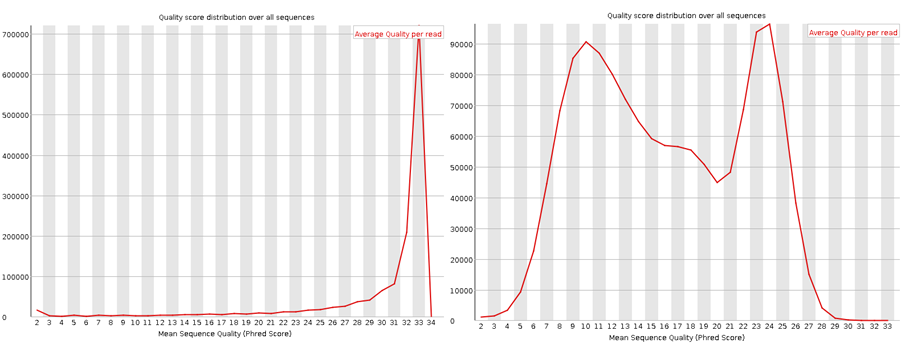
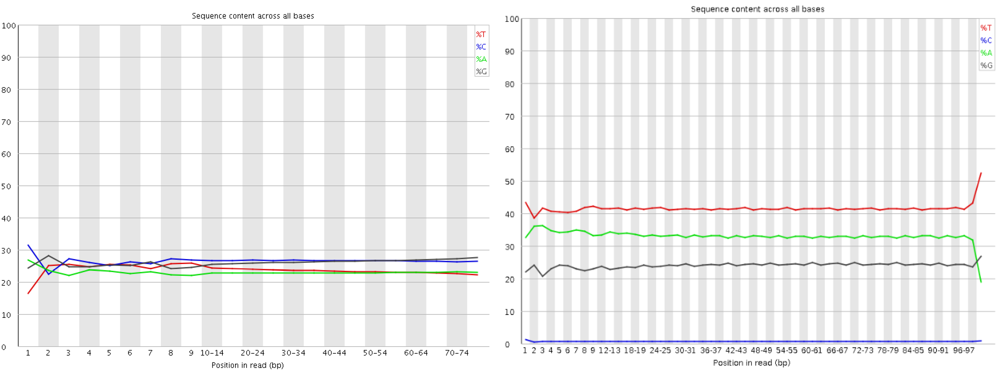
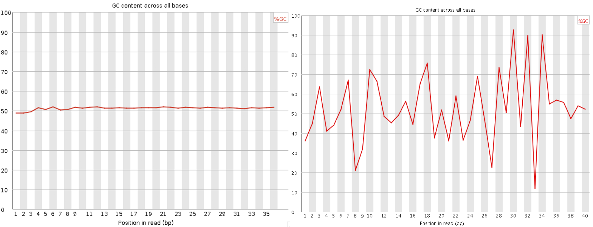
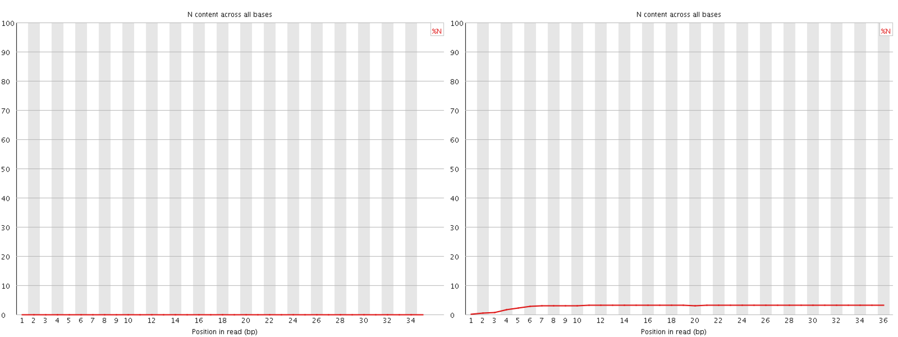
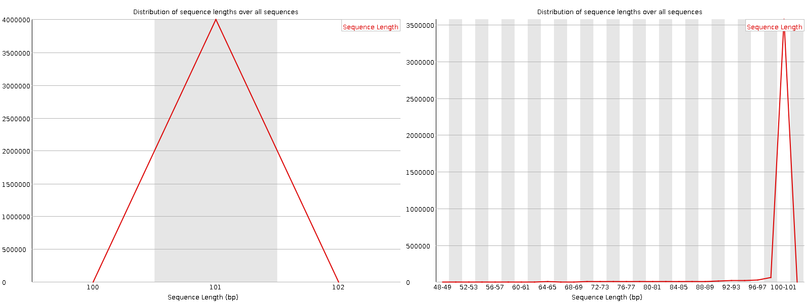

# Overview
A variant calling workflow starts with raw sequencing data for multiple individuals, and ends with a single file containing only the genomic positions where at least one individual in the population has a mutation or polymorphism.  The steps in this process are:

1. Using FastQC to verify the quality of each raw data file.
2. Removing low quality and spurious sequences (Trimmomatic).
3. Mapping individual sequences to a reference genome (Bowtie2)
4. Convert SAM files produced in Step 3 to BAM format files, then sort and index them (Samtools)
5. Perform variant calling on the sorted BAM files (GATK)
	1. Get genotypes in GVCF format for each individual (GATK HaplotypeCaller)
	2. Perform joint genotyping across all .gvcf files to get the final VCF file for the population (GATK GenotypeGVCFs)

On Day 1, we will only be working with a single file to start with, so we will *not* do Step 5, part 2 (yet).  On Day 2, after we have looked at running those same steps in parallel on all of the other raw data files, we will complete the last part of the pipeline to get the final VCF file.

# FastQC
FastQC is a program that can check the quality of any fastq file output from a next-gen sequencer, so it is not specific to the SNP calling pipeline.  To use this program, we need to make sure that we are logged onto palmetto with X11 forwarding (or the Windows equivalent):
~~~
ssh -X ecoope4@user.palmetto.clemson.edu
~~~

We will also need to use the -X option when requesting an interactive node:
~~~
qsub -X -I -l select=1:ncpus=2:mem=31gb:interconnect=1g,walltime=1:00:00
~~~

Once you are on an interactive node, load the software module for FastQC, and start the program by simply typing "fastqc" in the command line:
~~~
module load fastqc/0.10.1
fastqc
~~~

This will open up an X11 window with the FastQC startup window.  From the File menu, select Open, and then navigate to the SRR098034.fastq file in your genomics-workshop/Raw_Fastq folder.

In addition to calculating some basic statistics about each file, FastQC runs 10 different checks on various metrics that might be related to quality of the data.  It will alert you when any of the checks fail or produce questionable results.  One thing to remember: FastQC was written with whole genome resequencing data in mind, so it expects lots of randomly sheared fragments representative of the whole genome.  If you run FastQC on non-random data (i.e. RNA-seq, CHiP-seq, GBS, target Amplicon), you may get several failed tests, but this does NOT necessarily mean your data are bad, just that they don't look like WGS data.

## Per Base Sequence Quality

Shows the ranges of quality values across the length of all sequences in the Fastq file.  X-axis is position within a sequence/read, y-axis is the Phred scale quality score.  It is common to see lower quality values towards the ends of reads.  Looking at this plot will give you a good idea of how much trimming you will need to do in Step 2.  

## Per Sequence Quality Score

This check calculates the average quality for each read (over all bases), and then reports the frequency distribution for the mean qualities in your sample.  The x-axis is the range of possible Phred scale quality scores (1-40), and the y-axis is the number of sequences with that mean quality score.  This test lets you see if there is a subset of reads in your sample that have universally low quality values.

## Per Base Sequence Content

A plot of the percentage of each of the 4 bases (A,C,G,T) found at every position across all of the reads in your sample.  The x-axis is position within a read; the y-axis is the percentage of reads with a particular base at that position; the colors indicate each different base.

The purpose of this test is to check the randomness of your library (FastQC expects that the percentage of each base should be roughly equal across all positions).  If you have non-random data, this is one of those tests that will fail, even though your data are fine.  Note that exome or RNA-seq would have elevated GC content, which would affect this test.

If you did expect the data to be random, and this test fails, it could indicate either PCR bias (a library prep problem) or sequencing bias.

## Per Base GC content

Very similar to the per base sequence content test, this check looks at the %GC at each position in a read across all reads in the sample.  A random library would have a horizontal line (same GC content across all bases) at whatever percentage value reflects the GC content of the reference genome.  A failure in this test can be interpreted in the same way as a failure in the per base sequence content test.

## Per Sequence GC content

First, FastQC calculates a theoretical distribution of GC content by using the empirical percentage of GC in your data, and assuming it is normally distributed.  Then, the red line plots the  actual per read %GC.  If the red line and blue line do not match up, then some subset of your reads are showing a bias that could indicate some kind of contamination or PCR bias.

Even in non-random data, this test should not fail, because the theoretical distribution is calculated on your underlying data.

## Per base N content

Plots the percentage of missing data (represented by N) at each position in the sequence across all reads.  At the very end or the very beginning of a read, it is not all that unusual to see some small proportion of Ns (and this would indicate a need for read trimming in Step 2), but in general this line should be at or near the bottom of the graph.  If this test fails, it could indicate that your library was bad, or that the sequencing run essentially failed for some other reason.

## Sequence Length Distribution

This test generates a graph showing the distribution of fragment sizes in your data.  X-axis is the range of possible read lengths in base pairs; y-axis is the number of reads with that length.  For raw Illumina data, all of your reads should be exactly the same length, so you will just get a sharp peak and not a real distribution here.  Some other platforms may generate reads of multiple lengths, and after you run a trimming program you might see reads of multiple lengths as well.

The test will fail if there is any difference in read length, but note again that you may or may not expect some differences depending on where your data came from.  One reason to pay attention to this flag is because some alignment programs won't accept data with multiple lengths, so you would want to trim all of your reads to the same length before running these.

## Sequence Duplication Level

The module counts the number of times a particular sequence appears in your data set, and plots the relative number of sequences with each level of duplication.  The x-axis is the number of possible duplicates, and the y-axis is the number of sequences with that many copies.

In random data, as well as only pseudo-random data (RNA-seq, exome), most sequences should occur only once, so you should see a sharp peak on the left followed by exponential decay.  If you have very high coverage, you might see a low level of duplication; otherwise a high level of duplication would indicate PCR bias.

If you run FastQC on amplicon data or GBS, this test may fail, since you expect to have high copy numbers of the same sequence.

## Overrepresented Sequences

For any sequences that make up more that 0.1% of the total data, this check will list them and check them against known contaminants.  Contaminating sequence could come from microbes, or even from an excess of unincorporated Illumina adapters in your sample.  Even if there is no match for the overrepresented sequences, this test still reports them (since it could indicate some other contaminant or library issue).

If you run FastQC on a GBS library, which has restriction enzyme recognition sites in every sequence, or on CHiP-seq, which likely has common recognition motifs, there is a good chance this test will fail, even though your data are fine.  

If your data pass this test, FastQC won't report anything (no plot or table) for this test.

## Overrepresented Kmers

Very similar to the previous test, except with Kmers the sequences do not have to be exact matches to be considered duplicated, they just have to be very similar.  This helps detect contamination and PCR bias even when errors and missing data cause sequences to not be identical.

Barcode sequences in multiplex libraries can also show up here.

# Trimming
Trimmomatic will clean up the raw sequencing data by removing any reads or parts of reads that fall below a specified quality threshold, and also by checking for and removing adapter sequences left over from the Illumina library construction.

Trimmomatic is a Java application, so we need to first load the java module.  When we run the program, note that we need to specify the path to the .jar file:

~~~
cd /scratch2/$USER/genomics-workshop
mkdir Trimming

module load java/1.8.0

java -jar /software/trimmomatic/0.30/trimmomatic-0.30.jar SE \
-threads 2 \
-phred33 \
-trimlog Trimming/SRR098034.log \
Raw_Fastq/SRR098034.fastq Trimming/SRR098034.trim.fq \
ILLUMINACLIP:adapters.fasta:2:30:10 \
TRAILING:20 MINLEN:30 AVGQUAL:30
~~~

**Details on the Trimmomatic Parameters:**
+ SE : Specifies Single End read (vs. paired end)
+ phred33 : Version of Illumina quality encoding (vs. phred64)
+ ILLUMINACLIP:adapters.fasta:2:30:10 - Cut illumina-specific adapter sequences from the read.  
  * Adapter sequences are given in the file adapters.fasta.  
  * 2 is the maximum number of mismatches to allow when searching for the adapters in the sequences (w/out affecting the match score).  
  * 30 is the palindrome clip threshold, which specifies the minimum match score for paired end adapters.  
  * 10 is the minimum match score for adapters in single end reads.
+ TRAILING:20 : Removes bases starting at the end of the sequence if they fall below a certain quality threshold (in this case, we set the threshold at 20).
+ MINLEN:30 : After removing low quality bases, discard all reads that fall below a certain length (in this case 30 bp).
+ AVGQUAL:30 : Remove reads falling below an average quality threshold (in this case 30)

## Exercise 1
Run FastQC on the cleaned .fq file from the Trimmomatic output.  Can you tell that the trimming step has made a difference?  Which tests in FastQC look the most different compared to the original?

# Mapping to the Reference Genome
For the sample data used in this workshop, we will be mapping everything to the genome of *E.coli* strain REL606.  The fasta file for this genome has already been provided to you, but it was originally downloaded from [Ensembl](http://www.ensembl.org/index.html), which is an excellent resource for many publicly available genomes.  

We will be using the program Bowtie2 for mapping, which is a very commonly used aligner.  It is also very similar to BWA.  Bowtie2 will produce SAM format files, which has become the standard output format for mapped reads, and is now used by many programs.

Before we can align any reads, we have to first create an Index for our reference genome.  You only need to do this once for any reference genome file (i.e. not every time you map to it).
~~~
cd /scratch2/$USER/genomics-workshop
module load bowtie2/2.1.0
bowtie2-build Reference/Ecoli_Ref.fa Reference/Ecoli_Ref
~~~

Now that we have prepared the reference genome, we can run the alignment step on our trimmed .fastq file (this will take ~8 minutes):
~~~
mkdir Alignment

bowtie2 -x Reference/Ecoli_Ref \
--rg-id SRR098034 --rg "SM:ZDB83" \
-U Trimming/SRR098034.trim.fq \
-S Alignment/SRR098034.sam
~~~

# Samtools
After creating a SAM file with an alignment program, there can often be one or more intermediate steps you need to run before you can use the file in another program.  In practice, the exact steps you need/want will depend on your data set and what you want to do with it, but the [Samtools](http://samtools.sourceforge.net/) toolkit contains numerous useful functions specifically for SAM files.  The functions we will use today are:
1. Converting from SAM to BAM format (BAM is just a compressed form of SAM)
2. Sorting the BAM file by numerical position
3. Creating an index for the BAM file, which is required by GATK
4. Creating 2 new index files for the reference (in formats used by Samtools and GATK)

The command lines for running these 4 steps are:
~~~
mkdir BamFiles
module load samtools/1.4

samtools view -O BAM Alignment/SRR098034.sam -o BamFiles/SRR098034.bam
samtools sort -o BamFiles/SRR098034.sort.bam -O BAM BamFiles/SRR098034.bam
samtools index -b BamFiles/SRR098034.sort.bam
samtools faidx Reference/Ecoli_Ref.fa
samtools dict -o Reference/Ecoli_Ref.dict Reference/Ecoli_Ref.fa
~~~

# GATK HaplotypeCaller
The final task for Day 1 is to run the GATK HaplotypeCaller to generate a .gvcf file for our first individual. This file will be used on Day 2, once we have also created the .gvcf files for the 4 other individuals, to generate the final VCF file.  You can also check out the [GATK Best Practices](https://software.broadinstitute.org/gatk/best-practices/bp_3step.php?case=GermShortWGS) for a nice overview and detailed explanation of the variant calling pipeline.

[GATK](https://software.broadinstitute.org/gatk/), like Samtools, has a lot of uses and functions in addition to the ones we will use in this workshop.  It is one of the most commonly used programs for variant calling (even though there are many others), which is why we are using it here.  To run the HaplotypeCaller:

~~~
module load java/1.8.0
module load GATK
mkdir SNPs

java -jar $GATK -T HaplotypeCaller \
-I BamFiles/SRR098034.sort.bam \
-R Reference/Ecoli_Ref.fa \
-o SNPs/SRR098034.gvcf \
-ERC GVCF \
-variant_index_type LINEAR \
-variant_index_parameter 128000 \
-ploidy 1
~~~

**Details on GATK Parameters:**
+ `-T HaplotypeCaller`: This specifies that the particular GATK tool we want to use is the HaplotypeCaller.
+ `-ERC GVCF`: ERC stands for Emit Reference Confidence.  This means we want the program to estimate the probability of a given genotype being the reference base at each site in the file.  GVCF mode tells the program to output every site in the genome (whether or not there appears to be a mutation).  This is necessary for merging genotype information across multiple samples later.
+ `-variant_index_type LINEAR`: Index creation is something GATK does to help for fast searching a processing in other steps.  LINEAR specifies the type of index to create.  You shouldn't ever need to mess with this parameter.
+ `-variant_index_parameter 128000`: This specifies the size of the "bins" to use when indexing the data.  It again is not something you really need to mess with.
+ `-ploidy 1`: Sample ploidy (number of chromosome copies per individual).  GATK uses this information when estimating genotype likelihoods, based on expected allele frequencies.  Because E. coli is haploid, we set this value to 1.  

## Exercise 2
Now that you've seen what the command line looks like for a couple of Samtools functions, you should have a general idea of how to run any of the tools in Samtools.  Try running the tool "flagstat" to get some general statistics about your bam file.  To see the options for any samtools command, all you have to do is type the command name with no options:

~~~
$ module load samtools/1.4
$ samtools flagstat
Usage: samtools flagstat [options] <in.bam>
      --input-fmt-option OPT[=VAL]
               Specify a single input file format option in the form
               of OPTION or OPTION=VALUE
  -@, --threads INT
               Number of additional threads to use [0]
~~~

Or, you can check the [Samtools Manual](http://www.htslib.org/doc/samtools.html) online.  For interpreting the results of flagstat, check out [this page](https://davetang.org/wiki/tiki-index.php?page=SAMTools) describing several samtools options in more detail and with examples.

